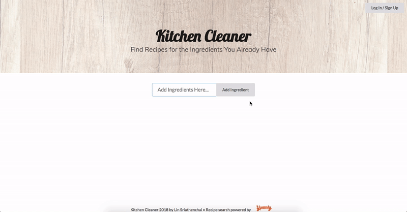
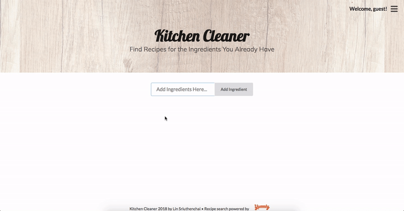
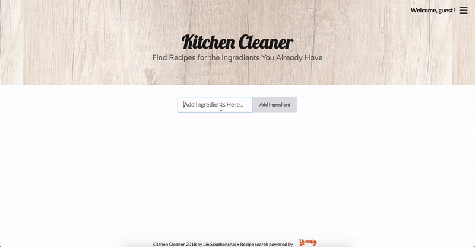
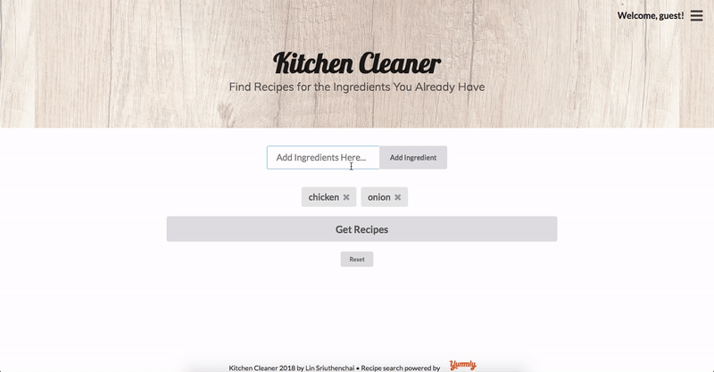
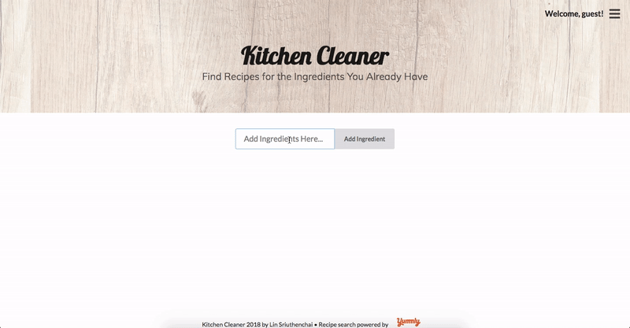

# Kitchen Cleaner

Kitchen Cleaner is a web application that helps you find recipes for the ingredients you already have on hand (or in the back of the fridge and that are going bad soon). You can save your favorite recipes to access them again in the future. Use Kitchen Cleaner on your next meal prep and never waste any food again!

## Live Demo
Play around with the [live demo here](https://kitchen-cleaner.herokuapp.com/). You can start exploring the app by typing in a list of ingredients and click `Get Recipes`, but if you want to save a recipe you must sign up for a new account and/or be logged in.

## Installing Locally

1. Follow on the links for both the [frontend](https://github.com/linsuri/kitchen-cleaner-frontend) and [backend](https://github.com/linsuri/kitchen-cleaner-backend).
2. Clone both of them down into separate folders on your computer.
3. In the command line, `cd` into the backend folder and run `bundle install`.
4. Run `rails s` to start your backend server. It should run on `localhost:3000`.
5. Open another tab in your command line, `cd` into the backend folder and run `npm install`.
6. Run `npm start` to start your frontend server. If you are prompted to run the server on a different port than your backend, type `y`. Your frontend server should run on `localhost:3001`.

After you run `npm start`, a tab in your browser should open automatically.

You can start exploring the app by typing in a list of ingredients and click `Get Recipes`, but if you want to save a recipe you must sign up for a new account and/or be logged in.

## Features

* A user can sign up/log in.

* A user can add a list of ingredients that they have on hand.

* A user can delete individual ingredients.

* A user can delete all ingredients by clicking `Reset`.

* A user can see a list of recipes by clicking `Get Recipes`.

* If there are no results, there will be a message to let the user know.

* A user can save recipes to their favorites list.

* A user can delete recipes from their favorites list.

* A user reset the ingredients and search results.

## Built With

* [Rails](https://rubyonrails.org/)
* [PostgreSQL](https://www.postgresql.org/)
* [React](https://reactjs.org/)
* [Redux](https://redux.js.org/)
* [Semantic UI React](https://react.semantic-ui.com/)

## Links

* This project is powered by [Yummly API](https://www.yummly.com/recipes).
* This project is built on top of a one-week group project ([frontend](https://github.com/cmaniscalchi/cook-smart-frontend) | [backend](https://github.com/linsuri/mod-4-project-backend)) at [Flatiron School](https://flatironschool.com/) coding bootcamp. It was a privilege to get to work with [Claudia Maniscalchi](https://github.com/cmaniscalchi) who was such a wonderful partner on that project.
